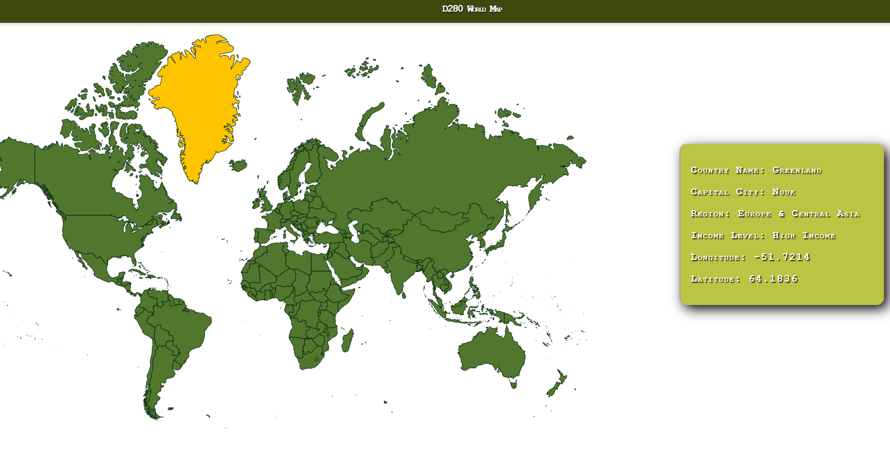

# 🌍 World Map App

An interactive SVG map that displays country data using the World Bank API.

## 🚀 Features
- Hover to see data by country
- Responsive SVG map
- World Bank API integration

## 📸 Screenshot


## 📦 Technologies
- JavaScript
- HTML/CSS
- SVG
- REST API

## 📁 How to Run
```bash
npm install
npm start